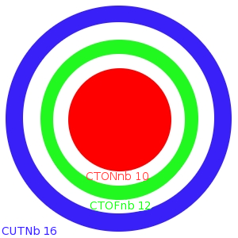

.. index:: Lennard-Jones, Bond, Stretch, Angle, Torsion

.. _con-energyfunctions:

Energy Function
===============

This section of the tutorial deals with how CHARMM calculates the potential
energy of a molecular system and its first derivative (the force or gradient).
CHARMM supports methods for evaluating molecular systems at varying levels of
theory; this section introduces the purely classical CHARMM force field (which
is distinct from the program itself). CHARMM the program includes support for
several other force fields as well as mechanisms to calculate *ab initio* and
semiempirical quantum mechanical energies and for coarse-grained modeling.
These topics are beyond the scope of this tutorial. 

In computational chemistry, a force field consists of two things: (1) a
functional form defining how to compute the energies and forces on each
particle of the system, and (2) a set of parameters that define how positional
relationships between atoms determine their energy (e.g. how the bonded
potential energy changes as a bond stretches or contracts, that is, as the
distance between two bonded atoms increases or decreases).

A full treatment of force fields and their development is beyond the scope of
this tutorial. Interested readers are encouraged to consult the `the Wikipedia
entry on force fields <http://en.wikipedia.org/wiki/Force_field_(chemistry)>`_
and the molecular modeling references given in the introduction (particularly
chapter 2 of Becker *et al.*).

The force field terms
*********************

The molecular mechanics force field used by CHARMM and similar computer
programs is a simplified, parametrized representation of reality. Interactions
between chemically bonded nearest neighbors are handled by special terms, the
so-called bonded energy terms: e.g., bond stretching, angle bending, dihedral
and improper dihedral energy terms.  Interactions beyond (chemically bonded)
nearest neighbors are represented by the two so-called non-bonded energy terms
(Lennard-Jones (LJ) and Coulomb interactions). Very early versions of the
force-field contained a special term for hydrogen bonds; the code is still in
CHARMM, but it is, in general, not used anymore. 

Thus, the energy function of the latest CHARMM "param22"/"param27" force field
has the following form ([MacKerell98]_, [Foloppe00]_, [MacKerell00]_, [MacKerell04]_):

:math:`U_{\mathit{CHARMM}}=U_{\mathit{bonded}}+U_{\mathit{non-bonded}}`

where :math:`U_{\mathit{bonded}}` consists of the following terms,

:math:`U_{\mathit{bonded}} = U_{\mathit{bond}} + U_{\mathit{angle}} + U_{\mathit{UB}} + U_{\mathit{dihedral}}
+U_{\mathit{improper}}+U_{\mathit{CMAP}}`

with 

:math:`\qquad\qquad U_{\mathit{bond}}=\sum_{\mathit{bonds}}K_b(b-b^0)^2`,

:math:`\qquad\qquad U_{\mathit{angle}}=\sum_{\mathit{angles}} K_\theta(\theta-\theta^0)^2`, 

:math:`\qquad\qquad U_{\mathit{UB}}=\sum_{\mathit{Urey-Bradley}} K_{\mathit{UB}}(b^{1-3}-b^{1-3,0})^2`,

:math:`\qquad\qquad U_{\mathit{dihedral}}=\sum_{\mathit{dihedrals}}K_\varphi((1+\cos(n\varphi-\delta))`,

:math:`\qquad\qquad U_{\mathit{improper}}=\sum_{\mathit{impropers}}K_\omega(\omega-\omega^0)^2`, and

:math:`\qquad\qquad U_{\mathit{CMAP}}=\sum_{\mathit{residues}} u_{\mathit{CMAP}}(\Phi,\Psi)`

:math:`U_{\mathit{non-bonded}}` consists of two terms,

:math:`U_{\mathit{non-bonded}}=U_{\mathit{LJ}}+U_{\mathit{elec}}`

with 

:math:`U_{\mathit{LJ}}=\sum_{\mathit{nonb. pairs}}\varepsilon_{ij}\left[
\left(\frac{r^{\mathit{min}}_{ij}}{r_{ij}}\right)^{12}-
2\left(\frac{r^{\mathit{min}}_{ij}}{r_{ij}}\right)^{6} \right]`,

:math:`U_{\mathit{elec}}=\sum_{\mathit{nonb. pairs}}\frac{q_i q_j}{\epsilon r_{ij}}`

The values of the naught terms above (*e.g.* :math:`b^0` in
:math:`U_{\mathit{bond}}`, :math:`\theta^0` in
:math:`U_{\mathit{angle}}` *etc.*), the various force constants
(:math:`K_b`, :math:`K_\theta` *etc.*), as well as partial charges
:math:`q_i` and LJ parameters (:math:`\epsilon`,
:math:`r^{\mathit{min}}`) are taken from the force field parameters. The
atomic LJ parameters :math:`\epsilon`, :math:`r^{\mathit{min}}` are
combined with the appropriate mixing rules for a pair of atoms i, j. In the
current CHARMM force fields, these are
:math:`\epsilon_{ij}=\sqrt{\epsilon_i\,\epsilon_j}` (geometric mean) and
:math:`r^{\mathit{min}}_{ij}=\left(r^{\mathit{min}}_i+r^{\mathit{min}}_j\right)/2`
(arithmetic mean). Note that other force fields may use other mixing rules,
such as the geometric instead of the arithmetic mean for
:math:`r^{\mathit{min}}_{ij}`

Both non-bonded terms are normally modulated by a shifting or switching
function (however, periodic boundary conditions may be used in place of this
modulation, particularly for electrostatics), see below.

The above terms are the standard terms of molecular mechanics force fields just
described, with two exceptions that require some explanation. The first is the
so-called "Urey-Bradley" (:math:`U_{\mathit{UB}}`) term in addition to the
standard bond stretching :math:`U_{\mathit{bond}}` and angle bending terms
:math:`U_{\mathit{angle}}`. The Urey-Bradley term is a harmonic term in the
distance between atoms 1 and 3 of (some) of the angle terms and was introduced
on a case by case basis during the final optimization of vibrational spectra.
This term turned out to be important "for the in-plane deformations as well as
separating symmetric and asymmetric bond stretching modes (*e.g.*, in aliphatic
molecules)" [MacKerell98]_.

A more recent addition to the CHARMM force field is the CMAP procedure to treat
conformational properties of protein backbones [MacKerell04]_. The so-call CMAP
term is a cross-term for the :math:`\phi,\,\psi` (backbone dihedral angle)
values, realized by grid based energy correction maps. It can, in principle, be
applied to any pair of dihedral angles, but is used in the current CHARMM force
field to improve the conformational properties of protein backbones. Several
programs claiming to be able to use the CHARMM force field(s) lack support for
this term, although it is being incorporated into an increasing number of
programs.

We note in passing that CHARMM can compute energies and forces with several
non-CHARMM forcefields, including converted versions of the AMBER and OPLS-AA
forcefield, but also more generic force fields, such as the Merck force field.
[**TODO: add refs**] Use of these force fields is beyond the scope of this
tutorial.

Non-bonded lists
----------------

Background on non-bonded lists
******************************

In molecular mechanical energy/force calculations a cut-off criterion is
normally used to limit the number of non-bonded interactions. Energy
minimizations and especially molecular dynamics simulations require hundreds
and thousands (if not millions) of energy/force calculations. To avoid checking
for excluded pairs (1-2, 1-3 and, possibly, 1-4 neighbors) and, much more
importantly, the cut-off criterion during every single energy calculation,
lists are generated that contain all pairs for which the non-bonded
interactions really have to be computed. This is an unnecessary overhead for a
single calculation, but saves a lot of time during repeated computations.

In fact, any energy calculation in CHARMM consists really of two steps: (1)
Calculation of the non-bonded list, (2) calculation of energy and forces using
this non-bonded list.  The time saving in repeated energy/force calculations
(e.g., minimization, MD) comes from the fact that the non-bonded list is not
generated for every energy calculation, but instead the list is kept for
several consecutive steps (energy calculations). Now suppose the non-bonded
list were generated with the cut-off radius used in the energy calculation
(*CTOFnb*). The forces calculated in the first energy calculation are used to
generate new particle positions (regardless whether we are doing minimization
or MD). Because of the movement of the atoms, the original non-bonded list may
not be correct anymore, i.e., it may contain pairs that are separated by more
than *CTOFnb* and, worse, there may now be pairs less than CTOFnb apart for
which no interactions are computed since they are not part of the list. For
this reason, the non-bonded list should always be generated with a cut-off
criterion/radius larger than *CTOFnb*, and for this reason CHARMM provides the
separate CUTNB parameter used exclusively in list generation. With CUTNB >
CTOFnb (by at least 1-2 Å), we can be certain that the non-bonded list is valid
at least for a certain number of steps. This now explains the hierarchy of
cut-off options in the param22/27 ENERgy example above, where we had

.. code-block:: chm

 ENERgy ... CUTNB 14. CTOFnb 12. CTONnb 10. 

These are the recommended cut-off values for the standard CHARMM force field!
*CUTNB* controls the list generation, whereas *CTOFnb* and *CTONnb* are used
for the energy calculation as described above (*CTONnb* only for those
interactions modulated by a switching function). Bear in mind that when
periodic boundary conditions (PBC) are used for electrostatics, *CTONnb* and
*CTOFnb* only affected the van der Waals energy calculation. Graphically, the
relationship between the different cut-offs can be illustrated as in the
following scheme (where *CUTNB 16.* instead of 14. was chosen):

The difference between *CUTNB* and *CTOFnb*, sometimes referred to as "skin",
governs the frequency with which the non-bonded list needs to be updated.
Provided the update frequency is appropriate, the choice of *CUTNB* is a true
choice for the user, which should not affect the results, but which may affect
performance. A larger skin means more work for a single non-bond list
generation, but the possibility of a  larger update frequency. The respective
performance from smaller / larger skins depend on the computer hardware, the
system size and whether the computation is carried out in parallel or not. No
general rule can be given, but frequently larger skins (e.g., 4 Å) perform
somewhat better than the default skin size of 2 Å; for large scale production
calculations it definitely is worth the time to experiment and benchmark to
find an optimal value for *CUTNB*.

A natural question that arises from this discussion is how often the non-bonded
list is updated. CHARMM allows the user to specify an interval at which the
list is updated, or the program can update the list automatically as needed. If
the former option is chosen, the keyword *INBFrq* is used, and *INBFrq n*, with
n a positive integer tells CHARMM to update the non-bonded list every n energy
calculations. The correct choice of n is left to the user and depends on the
size of the skin (cf. above). Alternatively, *INBFrq -1* (or any negative
integer) tells CHARMM to watch the particle positions and update the non-bonded
list automatically. The algorithm is guaranteed to err on the side of safety,
so with *INBFrq -1* one should always have a correct non-bonded list. For quite
some time, *INBFrq -1* (= heuristic update) has been the default (the old
default of +50 was horribly inadequate and almost guaranteed wrong results!);
nevertheless, this is one parameter that there is no harm in setting
explicitly.

Finally, as is so often the case, CHARMM offers more than one algorithm to
construct non-bonded lists; all of them, however, deliver a list in the same
format (so for the energy routines it is irrelevant how the non-bonded list was
generated!). Only two will be mentioned here. The old, default method is
labeled *BYGRoup*, and *BYGR* is the (optional) keyword that chooses this
method (again, it's the default). When performance is needed (large systems,
running on a parallel machine), then one should use *BYCB*. It supports normal
MD of solvated systems under periodic boundary conditions, but cannot be used
for some more advanced usage scenarios. Also, BYGR can generate non-bonded
lists suitable for group and atom based cut-offs; BYCB only supports atom based
cutoffs.

.. _con-energy-pme:

Ewald summation and PME
-----------------------

Some more rigorous background can be found on `Wikipedia
<http://en.wikipedia.org/wiki/Ewald_summation>`_. In the following I comment in
(over)simplified form on some aspects of Ewald / PME, which I find is
surprisingly often misunderstood in practice.

Ewald summation (ES) is a method to sum up (= calculate) electrostatic
interactions in an infinite lattice, or, alternatively to compute electrostatic
interactions under periodic boundary conditions. If you want to look at it that
way: with ES you take these periodic images "seriously". In symbols, the
starting point of ES is to compute the (infinite) sum (the lattice sum)

:math:`U_{\mathit{elec}}^{\mathit{periodic}}=\frac{1}{2}\sum_\mathbf{n}\,'\left(\sum_{i=1}^N\sum_{j=1}^N
q_i q_j\left|\mathbf{r}_{ij}+\mathbf{n}\right|^{-1}\right)`.

Here :math:`q_i`, :math:`q_j` are the charges of particles i, j,
:math:`\mathbf{r}_{ij}` is the vector between particle positions i, j, and
:math:`\mathbf{n}` is the lattice vector pointing into all periodic images of
the primary box. The prime in the sum over the :math:`\mathbf{n}` is used to
indicate that for :math:`\mathbf{n}=0` (primary box), the case i=j is excluded. 

:math:`U_{elec}^{periodic}` has the unpleasant mathematical property of being
conditionally convergent, *i.e.*, its value depends on the order of summation.

In addition to being conditionally convergent, direct computation of the above
lattice sum would be extremely tedious since the convergence is also *slow*.
ES is a trick to accelerate the convergence; as a by-product the singularity of
the Coulomb interactions responsible for the conditional convergence is
avoided. (Thus, ES may be viewed as a modified lattice sum).

In ES the above sum is split into two sums, according to

:math:`\frac{1}{r}=\underbrace{\frac{\mathrm{erfc}(\kappa r)}{r}}_{\mathit{real}}+
\underbrace{\frac{\mathrm{erf}(\kappa r)}{r}}_{\mathit{reciprocal}}`

Here, *erf* and *erfc* are the error and complementary error functions,
respectively. For a suitable choice of :math:`\kappa`, the first term on the
right hand side is short-ranged, whereas the second term contains all the
long-range interactions. More specifically, if :math:`\kappa` is   chosen
sufficiently large, for the first term only interactions in the primary
simulation box need to be taken into account (think of the erfc term acting as
a "shifting" function, damping the long range 1/r potential rapidly to zero.
Thus, the kernel labelled *real* leads to the *real space sum of
electrostatic interactions* which is computed normally (using the
complementary error function erfc(x) as a "shifting" function),

:math:`U_{\mathit{elec}}^{\mathit{real}}=\frac{1}{2}\left(\sum_{i=1}^N\sum_{j=1\ne i}^N
q_i q_j \frac{\mathrm{erfc}(\kappa r)}{r_{ij}}\right)`.

The kernel labelled *reciprocal*, on the other hand, is long-ranged, and
summation here would have to run over all lattice vectors **n**. Long-ranged
interactions, however, become short-ranged in reciprocal space (hence the
name), and essentially by Fourier transformation the sum resulting from the
*reciprocal* kernel becomes a rapidly converging sum in reciprocal space,
referred to as a "reciprocal sum" or "k-sum". 

The exact mathematics adds a few additional terms and corrections, which CHARMM
computes correctly, and hence we can afford to ignore. The computationally
intensive parts are the real space and reciprocal space sums just discussed.
The former, as pointed out, can be computed within the normal framework of
non-bonded interactions, whereas the second is a somewhat funny term, entailing
a double sum over atom positions and reciprocal space vectors.  We spare you
the details since the k-sum is nowadays usually computed by the so-called
*particle-mesh-Ewald* (PME) technique. (*Note: one sometimes gets the
impression that ES and PME are considered different methods. This is not so:
PME is just a fast, efficient way of approximating one term of the ewald sum,
namely the k-sum!*)

The basic trick of PME consists of the fact that the k-sum is not computed for
atom positions, but for fixed positions on a grid. This allows CHARMM to
pre-compute a lot of stuff *and* to use fast fourier transforms (FFT) to
speed things up further. The atomic charges are smeared out on a grid in each
step, potential (and forces) computed on the grid and are back-transformed to
their atomoc positions. By using so-called B-splines for the "smearing", it
suffices to compute the potential; the forces are obtained by differentiation
of the splines (this avoids separate FFTs for potential and force
calculations). Traditional ES scales approximately as :math:`N^{3/2}` for :math:`N`
atoms; PME scales as :math:`N\log N`, which makes a big difference for large
systems.

CHARMM implements both traditional ES as well as PME to compute the k-sum.
Historically, the two methods were coded independently, and the older
implementation of ES has a number of limitations. Since it is also much slower
than PME, only PME is discussed subsequently.

.. todo:: This is to be completed by :ref:`developers-acs` and :ref:`developers-fcp`.
