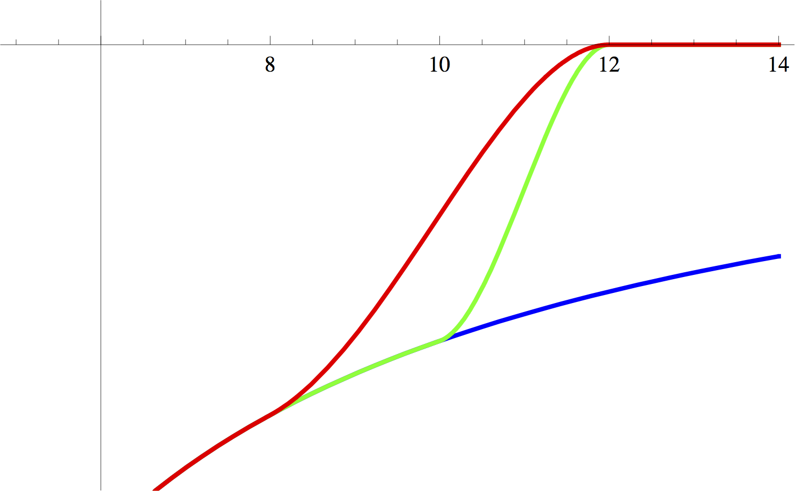

.. todo:: This was ripped from charmmtutorial.org.  Make sure it all finds a home in the right place.
.. index:: ENERgy

.. _usr-basic-energy:

The ENERgy command
------------------

The *ENERgy* command is actually doing more than computing the energy since it
also takes care of computing the non-bonded list. In fact, it is relatively
smart and computes a non-bonded list if none exists (or if it is deemed
outdated), but uses an up to date non-bonded list, should one be available.
Thus, the *ENERgy* command is actually encapsulates a lot of the core
functionality of CHARMM. Not only does invoking it cause CHARMM to calculate
the total energy of the system and the forces acting on each atom, but it also
makes CHARMM take care of any necessary bookkeeping work such as regenerating
the non-bond and image atom lists (we'll talk more about image atoms below).

If you look again at the options we have discussed so far, then they fall into
two groups, (1) those that control details of the energy calculation (*e.g.*,
*CTOFnb*), and (2) those thar control the non-bonded list generation (*CUTNB*,
*INBFRQ*, *BYGR*/*BYCB*). If you go beyond a single point energy calculation
(minimization, MD), then you have a third class of options controlling details
of the minimization or MD.

The various steps hiding underneath the ENERgy command can actually be broken
up; we show this for pedagogical purposes; also, the availability of the
*NBONds*, *UPDAte* and *GETE* commands is occasionally useful in practice as
well. *NBONds* parses and stores the energy related options, as well as list
generation options. The *UPDAte* command generates the actual list (optionally,
one could also here specify list generation and energy options). Finally,
*GETEnergy* just computes the energy, the existence of a *valid* non-bonded
list is assumed (otherwise your CHARMM job will crash). First, the standard way
using ENERgy

.. code-block:: chm

 ! read RTF file
 ! read param file
 ! read PSF
 ! read coordinates

 ! compute energy of system, explicitly specifying the (default)
 ! options
 ENERgy NBXMod  5 ATOM CDIEl SHIFt VATOm VSWItch -
 CUTNb 14.0 CTOFnb 12.0 CTONnb 10.0 EPS 1.0 E14Fac 1.0 WMIN 1.5

Instead, the same can also be accomplished in steps:

.. code-block:: chm

 ! read RTF file
 ! read param file
 ! read PSF
 ! read coordinates

 ! parse non-bonded options
 NBONds NBXMod  5 ATOM CDIEl SHIFt VATOm VDIStance VSWItch -
 CTOFnb 12.0 CTONnb 10.0 EPS 1.0 E14Fac 1.0 WMIN 1.5 -
 INBFrq -1 CUTNb 14. ! list options
 
 ! do generate list
 UPDAte 
 
 ! calculate "just" the energy 
 GETE

As mentioned, the *MINImiziation* and (molecular) *DYNAmics* commands
understand all options controlling non-bonded list generation and non-bonded
energy / force calculation, as well as options specific to the individual task
(minimization, MD). In particular for DYNA, the cumulative number of options
(list generation, energy calculation, control of MD) can easily amount to
30-50. Such a command line can be become quickly very confusing.  Given that
list generation and energy options are remembered, it is therefore recommended
to split the setting of options as shown below:

.. code-block:: chm

 ...
 ! PSF and full set of coordinates have been read
 ! optionally, periodic boundary conditions (see below) have been set up
 ENERgy <list options> <energy options>
 DYNA <only dynamics specific options>

Instead of ENERgy, one could also use NBONds/UPDAte.

.. _usr-basic-energy-cutoffs:

Calculation of non-bonded energies: cut-offs, shifting, switching etc.
**********************************************************************

The most time consuming part of an energy or force computation is the
evaluation of the LJ and electrostatic interactions between (almost) all pairs
of particles.

While straightforward in principle (and in practice energy/force calculation in
CHARMM is as simple as

.. code-block:: chm

 ENERgy

issuing a single command), numerous options influence the calculation of
non-bonded interactions, and so it is very important that you understand their
meaning and have the necessary background to understand the rationale for them
in the first place.

To compute the interaction of N atoms with each other, one needs in principle
:math:`N \times N` steps. Bonded interactions only involve next neighbors, so
they are cheap in terms of computer time. For the non-bonded energy (LJ,
electrostatic) it is customary to introduce a cut-off beyond which interactions
are ignored. This is a reasonable approximation for the van der Waals (= LJ)
interactions, which decay rapidly for large distances, but a bad one for
electrostatic interactions which go to zero as :math:`1/R`. For periodic
systems (the typical situation found when simulating solvated proteins), the
so-called Ewald summation method (usually employed in its fast incarnation,
particle-mesh-Ewald (PME)) circumvents this particular difficulty;
nevertheless, cut-offs are ever present in molecular mechanics energy/force
calculations and their implications need to be understood.

**Non-bonded exclusions:** Before continuing on the subject of cut-offs, we
need to introduce the concept of "non-bonded exclusions". To avoid computing
interactions between chemically bonded atoms (1-2, 1-3 and, possibly, 1-4
neighbors) with multiple different force field terms (specific bonded terms, as
well as the "unspecific" LJ and electrostatic term), these pairs are excluded
from the non-bonded energy calculation. When using the CHARMM force field, one
never calculates non-bonded interactions between 1-2 and 1-3 neighbors. LJ and
electrostatic interactions between 1-4 neighbors are calculated, but can be
modified compared to more distant pairs (different LJ interactions, scaling of
electrostatic interactions). The details depend on the specific force field
used. *e.g.*, in the older polar hydrogen force field ("param19"), electrostatic
interactions and forces between 1-4 neighbors were scaled by 0.4, whereas in
the current all-atom force field(s) ("param22", "param27"), electrostatic
energies and forces are used as is.  This scaling factor is controlled by one
of the many options to the *ENERgy* command, *E14Fac*. Thus, for calculations
with the old, polar-hydrogen "param19" force field, *E14Fac* should be set to
0.4; for calculations with the current "param22/27" force field it should be
set to 1.0. **IMPORTANT HINT:** E14Fac is an example of a user settable
option which should **never**  be set by a normal user. When you read in
the respective parameter file, the correct default value is automatically set.
In fact, many of the options to the *ENERgy* command are of this type --- you
should understand these, but, again, you should never change them (unless you
are an expert and develop a new force field etc. in which case you won't need
this tutorial!).  We'll return to the issue of specifying all possible energy
options as opposed to relying on defaults later on; unfortunately, this is less
clear-cut than it ought to be.

**Back to cut-offs:** The CHARMM keyword to set the cut-off for electrostatic
and LJ interactions is *CTOFnb*. Thus, the statement

.. code-block:: chm

 ENERgy CTOFnb 12.0 ! it's not recommended to have 
                    ! a blanket cut-off, switching
                    ! or shifting should be used

discards LJ and electrostatic interactions between all pairs of particles that
are greater than 12.0 angstroms apart (of course any non-bonded exclusions are
always honored!). The straightforward application of a cut-off criterion as in
the above (bad) example introduces a discontinuity that can adversely affect
the stability of a molecular dynamics calculation. Consider a pair of atoms
that are separated by approximately the cut-off distance. At one time-step they
interact and contribute to the energy and forces in the system. Then they move
relative to each other by a tiny amount and suddenly they are more than the
cut-off distance apart. Although very little has changed, they now do not
contribute to the energy and forces at all.

To avoid these abrupt changes, the LJ and electrostatic energy functions in
CHARMM are (always) modulated by *switching* or *shifting* functions (it
actually takes some tricks to coax CHARMM into doing, effectively, a plain
cut-off for you!). For the full details, in particular the detailed functional
forms of switching and shifting functions, see J. Comput. Chem. 1983, 4, 187;
Proteins 1989, 6, 32; J. Comput. Chem. 1994, 15, 667. The effect of a switching
function on a LJ interaction is illustrated by the following figure. 

At *CTOFnb* 12., the interaction (and its derivative, *i.e.*, the forces) has to
be zero as shown. Up to an ''inner'' cut-off (*CTONnb*),  interactions between
the two particles are normal. Between *CTONnb* and *CTOFnb*, the normal
interaction is switched off (hence the name) by a sigmoidal function. At
distances greater than *CTOFnb*, interactions and forces are zero. The effect
of a switching function is shown for two different values of the inner cut-off,
8 angstroms (red) and 10 angstroms (green).

A *shifting function* also modulates the normal interaction between two
particles. The design goal is that the original interaction is modified so that
it approaches zero continuously at the cut-off distance (*CTOFnb*); in
addition, forces are required to vanish continuously as well at the cut-off
distance. Visually, it looks as if the original interaction were "shifted" so
that it became zero at the cut-off distance. **The actual function is more
complicated because of the requirement of continuity of potential and forces at
the cut-off distance!!** With shifting functions, only *CTOFnb* is meaningful
(as the cut-off radius), whereas an inner cut-off (*CTONnb*) is ignored.
Switching and shifting can be activated separately for LJ and electrostatic
interactions; i.e., the keywords *VSHIft* and *VSWItch* control whether a
shifting or switching function is applied to LJ interactions; similarly,
*SHIFt* and *SWITch* choose between shifting and switching function for
electrostatic interactions.  To illustrate this by a realistic example, let's
take a look at the options that correspond to the default force field choices
for the current CHARMM all-atom force field (param22/27)

.. code-block:: chm

 ENERgy SHIFt VSWItch CTOFnb 12. CTONnb 10.

The line indicates that electrostatic options are shifted to zero using a
cut-off value of 12 angstroms (*CTOFnb*) and that LJ interactions are modulated
by a switching function between 10 (*CTONnb*) and 12 angstroms (*CTOFnb*). Any
interactions beyond 12 angstroms are discarded. Note that the *CTONnb*
parameter is ignored for the shifted electrostatic interactions.

**Beyond SHIFt/SWITch:** In molecular dynamics, the determining factor are the
forces, not the potential energy. Thus, it has been suggested to apply
shifting/switching functions to the forces, rather than the potential. Such
methods are available in CHARMM as well, driven by keywords *VFSWitch* (for LJ)
and *FSWItch*/*FSHIFt* (for electrostatics). The *FSHIFt* option is usually the
default in c27 and later (non-protein) force fields. For the gory details see
`nbonds.doc <http://www.charmm.org/documentation/current/nbonds.html>`_ of the
CHARMM documentation. The recently introduced, so-called Isotropic periodic Sum
(IPS) method provides yet another approach to handle cut-offs in a smooth,
continuous fashion. However, all these options go beyond the scope of this
tutorial.

**GROUp vs. ATOM:** A cut-off criterion can actually be applied in two ways.
The default is to apply it on an atom by atom basis (keywords *ATOM*, *VATOm*,
the option with V in front pertains to the van der Waals (=LJ) energy
computation, that without to the electrostatic energy computation).  In
addition, there is the possibility of a group based cut-off (keywords GROUp,
VGROup). In the CHARMM force field topologies, the partial charges of molecules
/ residues are grouped into small clusters that are usually neutral, or, for
charged residues, carry a net charge of +/-1, +/-2 etc.  When GROUp/VGROup is
set CHARMM first computes the center of geometry for each of these charge
groups. If the distance between the centers of geometry for a pair of groups
are separated by more than the cut-off distance (*CTOFnb*), then no interaction
between all atoms of the two groups is computed. By contrast, in the atom by
atom case, some pairs of atoms in different groups might be inside and others
might be outside the cut-off distance. Thus, in general the two options give
different results. (Note: you cannot mix group and atom based approaches; i.e.,
the combinations ATOM/VGRO and GROU/VATO are illegal!) There are some
theoretical arguments that would indicate that the group by group based cut-off
criterion ought to be preferred. This is particularly the case if all groups
have an overall charge of zero, which is the case, e.g., for water. Contrary to
this, **it has been shown for the CHARMM parameters that the group by group
based cut-off criterion gives inferior results**; in addition, it is much
slower, explaining that ATOM/VATOm is the CHARMM default.

**Some remaining options:** Having said this, we can take a look at the full
default options of the current all-atom force field

.. code-block:: chm

 ENERgy NBXMod  5 ATOM CDIEl SHIFt VATOm VDIStance VSWItch -
 CUTNb 14.0 CTOFnb 12.0 CTONnb 10.0 EPS 1.0 E14Fac 1.0 WMIN 1.5

The strings which you don't know yet are *NBXMod 5*, *CDIEl*, *CUTNB 14.0*,
*EPS 1.0*, and *WMIN 1.5*. Of these, the only important one is *CUTNB* since
this is a value you may indeed want to change. It is the cut-off radius used to
generate the non-bonded pair list and is discussed in detail in the next
section.  *NBXMod 5* controls the handling of non-bonded exclusions (*cf.*
above), and setting it to 5 means skipping 1-2, 1-3 interactions and treating
1-4 interactions specially. The *WMIN* distance of 1.5 is used to print out
interaction pairs that are closer than 1.5 Å. At shorter distances, very high
LJ repulsion would result, and it's useful to be warned since such pairs could
cause problems in MD simulations.  *CDIEl* and *EPS* are two related options,
which nowadays are a left-over from a distant past and should be left alone. A
brief explanation: The solvent (water) is a very important determinant when
studying the properties of biomolecules. When computers were slower, one often
tried to avoid simulations in explicit solvent, and the two parameters can be
used to mimic the influence of solvent. Water has a high dielectric constant
(DC), which screens electrostatic interactions. To mimic the presence of water
in gas phase simulations, CHARMM allows the user to change the value of the DC
(:math:`\epsilon`) by the *EPS* keyword (default value is 1), *i.e.*, the
electrostatic energy is computed according to :math:`q_1\,q_2/(\epsilon\,r)`.
The *CDIEl* / *RDIEl* option is another attempt to mimic water in gas phase
simulations. *CDIE* stands for constant (uniform) dielectric, *RDIE* means a
distance-dependent dielectric, :math:`\epsilon=\epsilon(r)=\epsilon\cdot r`,
where :math:`\epsilon` on the right hand side means the number set by *EPS*.
Effectively, when you use *RDIE*, you compute a modified electrostatic energy
according to :math:`q_1\,q_2/(\epsilon\,r^2)`. **Nowadays when using explicit
solvent, you should  always use *CDIE* and leave *EPS* set to 1 (*i.e.*, leave
them at the default values!).**   Should the use of explicit solvent be too
expensive computationally, CHARMM nowadays offers several *implicit solvent*
models.

**A final remark on ENERgy options:** So, what non-bonded options should you
set? In fact, if you read in the default param22/27 parameter file (*e.g*,
par_all27_prot_na.prm), the options just discussed get set for you
automatically. At first glance, there is no need to set any of these options
explicitly; unfortunately, however, this turns out not to be true. This does
not mean that you should modify the default options "just for fun". Remember,
changing some values (e.g. CDIE or EPS, or replacing (V)ATOM by (V)GROUP , or
changing E14Fac) is outright dangerous/false. You may want, *e.g.*, to use some
of the force based shifting/switching methods, but you should be experienced
enough to understand thoroughly what you are doing and why you are doing it
since the parameters were developed with the options shown above.  In practice,
what you'll want to change/add is to request the use of Ewald summation (PME)
for solvated systems (see below); some PME related options need to be adapted
depending on your system size. Similarly, for performance reasons you may want
to choose a different non-bonded list cutoff *CUTNB* (but we need to understand
more about non-bonded lists first). Normally, you would not want to change the
cut-off radii *CTOFnb*, *CTONnb*, since they are part of the parameterization.
*Unfortunately, this is where it becomes tricky:* Suppose you work with the
param22/27 parameters, and, thus, correct default non-bonded options have been
set.  You decide (for reasons that will become clear in the next subsection) to
increase CUTNB from 14 to 16 Å. Thus, you specify

.. code-block:: chm

 ENERgy CUTNB 16. ! WARNING: may not do what you want!

and assume that everything else is left alone.  Unfortunately, for the above
CHARMM command another default mechanism kicks in. If you change *CUTNB*, but
do not set *CTOFnb* / *CTONnb* explicitly, the latter get changed according to
CTOFnb = CUTNB - 2. and CTONnb = CTOFnb -2., hence you would suddenly be
calculating with CUTNB 16. CTOFnb 14. CTONnb 12., which likely is not what you
had in mind.  It is, therefore, a bit dangerous to rely on defaults set by the
parameter file. Although unsatisfactory, we therefore recommend to set the
non-bonded options *explicitly* before doing any real work. The respective
energy line should be identical to the defaults set in the parameter file, with
the exception of individual parameters you might want to change, such as a
modified *CUTNB* or replacing *SHIFt* by *FSHIft*.

In addition, there is one case were you *have* to change *CTOFnb* (and hence
*CTONnb*): If you simulate small periodic systems, the minimum image criterion
dictates that the cut-off radius must be smaller or equal to half the
box-length (cubic PBC). For *CTOFnb 12*., this means that your cubic periodic
box should have a side length of at least 24 Å. Thus, for smaller systems,
*CTOFnb* (and, hence, *CTONnb*) have to be reduced. Interestingly, some known
workers  in the field (notably W. van Gunsteren and his group) find this such a
bad choice (*viz.* reducing the cut-off radius below the force field default), so
that the smallest boxes they use always have side lengths of twice the default
cut-off radius of their force field. (Again, for the CHARMM all atom force
field this would mean no boxes smaller than 24 Å!)

How CHARMM does PBCs
********************

CHARMM does things differently than most textbooks (the notable exception
being Rapaports' *Art of Molecular Dynamics Simulation*, where the general
approach taken by CHARMM is outlined), and, actually, differently than most
comparable programs. Here we describe the underlying algorithmic approach,
whereas in the next subsection we describe how things work from the user
perspective and what pitfalls one has to be aware of. 

CHARMM takes periodic images "seriously", *i.e.*, (a subset of) the atoms of the
periodic images surrounding the central box are generated. The name of the
routine that does this is MKIMAT (that's a subroutine name, not a CHARMM
command!); keep it in mind, we'll have to comment on this routine somewhat more
later on. First consequence: the actual number of atoms in your system with PBC
is (much) larger than the number of atoms in your central box. This apparent
"waste of memory" is put to good use for the sake of generality and also
performance. Contrast this with the textbook approach, the image boxes are not
really present, as an image atom "enters", a "real" atom "leaves/vanishes". The
number of image atoms is kept as low as possible by two factors. First, one
does not have to generate the atoms from all image cells. In 3D a central cubic
box is surrounded by 26 images. Of these, only, those to the right, top, and
the back of the central cubic system are needed along with those at the
vertices and edges, reducing this number to 14. Second, for large boxes (box
lengths of solvated protein systems are easily 60 - 100 Angstroms!), one does
not need to replicate the full box, instead, one needs only those image atoms
which are within the cutoff radius, or more correctly, the cutoff radius used
to generate the non-bonded list(s).

A periodic simulation system in CHARMM consists of the central box (*e.g.*, a
cube), and a (partial) layer of image atoms with width *CUTNB* (or actually
*CUTNB* + some safety distance). Now, one generates *two* non-bonded list,
one for atoms in the central box ("primary atoms"), and a second one between
primary atoms and image atoms. Non-bonded interactions are computed twice, once
with the primary-primary list, and once with the primary-image list. In the
CHARMM output you'll find the energies listed separately, *i.e.*, the total LJ
and electrostatic energy of a system is now the sum of two terms each. You'll
probably have to draw some diagrams (preferably in 2D) to convince yourself
that this works. There is one border line case, and that is the case of small
boxes. Here you have to ensure that the cutoff radius for the energy
calculation (:kw:`ctof`) is less than half the box length. As long as this is true,
even if entries for two particles (call them i and j) exist in **both** the
primary-primary and primary secondary lists, only one of the two distances can
be lower than half of the box size. If, on the other hand, :kw:`ctof` is greater
than half the box length then both distances could be lower than half the box
length and the interaction energy will be double-counted **(BTM: check this
with SB or Rick!!)***. By choosing a short enough cut-off, you ensure that the
minimum image convention is implicitly obeyed.  *Unfortunately*, CHARMM
provides no warning if you overlook such a case, and this is one of the
pitfalls lurking when using PBC in CHARMM. More in the next subsection. In
general, it is simply best to avoid small boxes, since reducing *CUTNB* brings
its own set of problems.

Use of CRYStal / IMAGe in its simplest form
*******************************************

Before dwelling on pitfalls, let's look at the practical aspects of setting up
PBC. The user interface for setting up PBC in CHARMM is provided by two
modules, *IMAGe* and *CRYStal*. *IMAGE* and *CRYSTAL* provide similar
capabilities and complement each other. One may also view *CRYSTAL* as an
interface to make *IMAGE* more user-friendly, and this is the way it is usually
employed nowadays.

Before trying the following snippets, You should have read in RTF, parameters,
PSF and coordinates for your system. Also, assuming a protein / water system,
we assume that you have DEFIned two atom selections, *protein* containing all
your protein atoms, and ''water'', containing all your water molecules (which
are often simulated in CHARMM via the TIP3 water model).  Finally, let's assume
that you have a box length of 60 Ang., and you are using / planning to use the
default cutoff parameters (CUTNb 14. CTOFnb 12. CTONnb 10., which are our
recommended cut-off parameters, although it does no harm to increase CUTNB to
16.0 as we do in some of our scripts, so long as the other parameters are given
explicitly) Then, the following four lines set up PBC for a cubic box:

.. code-block:: chm

 CRYSTal DEFIne CUBIc 60. 60. 60. 90. 90. 90. 
 CRYSTal BUILd CUTOff @XO NOPE 0 
 IMAGE BYREsidue XCEN 0.0 YCEN 0.0 ZCEN 0.0 SELE water END
 IMAGE BYSEgment XCEN 0.0 YCEN 0.0 ZCEN 0.0 SELE protein END

The first line defines the crystal symmetry (CUBIc in our example), and gives
the necessary information, side lengths A, B, C and the three angles
:math:`\alpha`, :math:`\beta`, :math:`\gamma`, which in our case are A = B = C
= 60 Å, and :math:`\alpha=\beta=\gamma=90^\circ`, respectively. The generic
form of the command would be

.. code-block:: chm

 CRYS BUILd DEFIme <type> A B C alpha beta gamma

(It is particularly easy to build rhombic dodecahedrons or truncated
octahedrons, which are often preferred over cubic simulation boxes. We
generally prefer to use rhombic dodecahedrons for globular systems and
hexagonal prisms for long, thin macromolecules.)

The second line initiates the building of image atoms. Since CHARMM knows about
cubic boxes, no further information about the crystal is needed, and *NOPEr*
(the number of crystal operations) is set to 0. More important is the *CUTOff*
parameter, which actually indicates how deep to construct the layer of image
atoms. In order to work with the non-bonded list approach of CHARMM, the
variable @XO (as we call it here, any variable name is fine, alternatively, you
can give the number directly) has to be as large as :math:`L/2` where :math:`L`
is the length of the unit cell. This is particularly important if there is a
significant amount of vacuum space within the unit cell.

The meaning of the third and fourth line ("raw" *IMAGe* commands for a change)
become clear once you understand the CHARMM way of handling PBC during a
minimization or MD simulation when the coordinates of all particles change
continuously. Eventually, particles in the primary box will drift out of the
box, and atoms in the image layer will enter the primary region (or "diffuse"
further away). This is no need for immediate concern, since the "skin" in our
non-bonded lists gives us a safety net (just as in the absence of PBC).
Eventually, however, the central box and the image layer will have to be
rebuilt (by the MKIMAT routine). The obvious time to do so is when the
non-bonded lists are recomputed. At this point all atoms are essentially
subjected to a PBC like test, but as outlined above, one has to avoid breaking
molecules into two. The two IMAGe lines tell CHARMM to apply periodic shifts to
water on a residue by residue (= molecule by molecule) basis (option BYREsidue,
line 3), whereas the protein is shifted as a whole (BYSEgment, line 4) -- in
the case of proteins, shifting by residues could pull off individual amino
acids or small groups of them!

This is it, or rather, this should be it. One would assume that once PBC is set
up (via *CRYStal* / *IMAGe* as shown), any non-bonded list update would update
both the primary-primary and primary-image list, and that *CUTNB* would be
understood as being applicable to the generation of both lists. Alas, not so
... For (lets assume) historical reasons, the update frequency for the two
lists (primary-primary, primary-image) are controlled by two different
parameters, *INBFrq* and *IMGFrq*; similarly, there are two cut-off radii,
*CUTNB* for the primary-primary and *CUTIM* for the primary-image non-bonded
lists. Obviously, *INBFrq* should always equal *IMGFrq*, and *CUTNb*. *CUTIM*
is often set to be equal to *CUTNB*, but it may be set larger if computer
memory permits to reduce the frequency of list building. To add insult to
injury, there is no mechanism to ensure that reasonable values have been chosen
for these parameters. For example, while *INBFrq* defaults to -1 (heuristic
update, which is good), *IMGFrq* has a default of 50, which is nonsensical!
Thus, it is a sad fact of life that **it is the user's responsibility to
ensure meaningful values for INBFrq, IMGFrq, CUTNb and CUTIm**, otherwise
rubbish can and will be produced. 

So, for the sake of good practice, let us show the necessary steps to set up
PBC for a cubic system and ensure correct energy / force calculations. For good
measure, we use a large than default *CUTNB*/*CUTIM*, and we request *BYCB*:

.. code-block:: chm

 ! read RTF

 ! read parameters (we assume param22/27, which in principle sets up
      ! most defaults correctly, i.e., what we get at this point
      ! corresponds to
      !   NONB nbxmod  5 atom cdiel shift vatom vdistance vswitch -
      !        cutnb 14.0 ctofnb 12.0 ctonnb 10.0 eps 1.0 e14fac 1.0 -
      !         wmin 1.5
      ! as discussed

 ! read psf

 ! read coordinates

 set rc 16.         ! value we want for CUTNB/CUTIM

 CRYSTal DEFI CUBI 60. 60. 60. 90. 90. 90. 
 CRYSTal BUILd CUTOff 30 NOPE 0 ! cutoff is half the unit cell length
 IMAGE BYRE XCEN 0.0 YCEN 0.0 ZCEN 0.0 SELE water END
 IMAGE BYSE XCEN 0.0 YCEN 0.0 ZCEN 0.0 SELE protein END

 ! now issue an ENERgy command to (re)set all defaults!
 ENER INBFrq -1 IMGFrq -1 CUTNb @RC CUTIm @RC BYCB -
      NBXMod  5 ATOM CDIEl SHIFt VATOm VDIStance VSWItch -
      CTOFnb 12.0 CTONnb 10.0 EPS 1.0 E14Fac 1.0 WMIN 1.5

 ! Note: in practice we would usually replace SHIFte 
 !       electrostatics by PME Ewald, see below

The above should guarantee that all subsequent minimization and or MD
calculations generate both non-bonded lists at correct intervals with sane
cut-off radii. As noted in the comment, the one unrealistic aspect of the above
code snippet is that PME is not set up. Normally, the ENERgy command above
would also be used to replace SHIFted electrostatics by PME; however, we first
need to introduce Ewald summation and PME.

Ewald summation / Particle-Mesh-Ewald (PME)
-------------------------------------------

Setting up PME
**************

:ref:`Ewald summation <con-energy-pme>` is requested by the *EWALd* option to
*ENERgy*, and PME is requested by adding *PMEWald* as an option. While the
original ES method had numerous options to fine-tune the calculation of
k-vectors, for PME only 4 additional options are relevant. The first is the
choice of :math:`\kappa`, the others specify the number of grid points in each
of the three spatial directions. A full energy call requesting PME looks like

.. code-block:: chm

 ! set up CRYStal / IMAGes (= PBC), otherwise the following will fail
 ENERgy ... EWALd PMEWald KAPPa 0.43 FFTX 64 FFTY 64 FFTZ 64

The above sets :math:`\kappa` to 0.43, and requests a :math:`64\times 64
\times 64` grid. As a rule of the thumb, the grid spacing in each spatial
direction should be approximately 1 Å. One has to keep in mind, however, that
the FFT implementation of CHARMM has certain limitations concerning the choice
of prime factors; essentially, only powers of 2, 3 and 5 are allowed, *e.g.*,
FFTX 27 (= 3x3x3) is OK, but FFTX 28 (= 2x2x7) is  not. Further, the more
powers of 2 relative to powers of 3 and 5, the better (i.e. faster). CHARMMing
uses an external Perl script to calculate optimal grid dimensions for a given
system size.

The trickier parameter is :math:`\kappa`. Since the real space sum is
calculated by the normal non-bonded routines, the cut-off radius *CTOFNB* is
applied. It, therefore, has to be sufficiently large as to ensure proper
damping so that at distances :math:`r\rightarrow r_{\mathit{cut}}` interactions
and forces are effectively zero. If the damping is too low (:math:`\kappa` too
small), then you miss interactions and introduce a severe error in your
calculations.  There are several rules of the thumb to check the correct choice
of :math:`\kappa`; below is the exact criterion to choose  :math:`\kappa` For
your value of :math:`r_{\mathit{cut}}` (:kw:`ctof`) and  :math:`\kappa` evaluate
(e.g., Mathematica!)

:math:`\lambda_{EW}(\kappa, r_{\mathit{cut}}) = \int_0^{r_{\mathit{cut}}} 4\pi
r^2 dr \left( \frac{\kappa}{\sqrt{\pi}} \right)^3 \,\, e^{-\kappa^2 r^2}`

To be on the safe side, if your :math:`\lambda_{EW}(\kappa,
r_{\mathit{cut}})<0.999`, increase :math:`\kappa` (ideally, 
:math:`\lambda_{EW}(\kappa, r_{\mathit{cut}})=1`).

Note that as long you use the the default :kw:`ctof` (12 Å), you can simply use
the default :math:`\kappa` of 0.43 as it has been chosen for this value of
:kw:`ctof`. In this case it is unnecessary to check the value via the above
equation. A less precise rule of thumb (from `ewald.doc
<http://www.charmm.org/documentation/current/ewald.html>`_) is to set
:math:`\kappa` to :math:`5/CUTNB`.

**Final note for running MD with PME:** The implementation of the PME in CHARMM
(as well as in most other comparable programs) does not conserve center of mass
translation (sum of all momenta is not exactly zero). If no provisions are
taken, your system might start to pick up a net translational velocity
component. To compensate / avoid this artifact, CHARMM enforces that during MD
you take out center of mass translation by specifying a non-zero *NTRFrq*
(reasonable values are from 500 to 5000, although it does no harm to set it
smaller).

**A theoretical PS:** ES is mostly discussed in the context of summing up
electrostatic interactions in an infinite lattice (see, *e.g.*, the
presentation in [Allen89]_). A different point of view can be found in the
presumably first publication in which ES was used in the context of a computer
simulation [Brush66]_.  The Ewald potential is simply the solution to the
Poisson equation under periodic boundary conditions.

A demonstration of how to use particle mesh ewald is given on the [[FINAL Full
example|complete example page]].

.. todo:: link the above sentence to the appropriate tutorial example

Suggested Nonbond cutoff scheme
-------------------------------

In general, it is a good idea to go with the nonbond cutoff scheme given in the
parameter file of the force field that you will be using. For example, the
CHARMM27 Protein/Nucleic acid force field gives default nonbond parameters of:

.. code-block:: chm

 NONBONDED nbxmod  5 atom cdiel shift -
   vatom vdistance vswitch -
   cutnb 14.0 ctofnb 12.0 ctonnb 10.0 -
   eps 1.0 e14fac 1.0 wmin 1.5

These are good default values for most simulations. In some cases when running
in vacuum, it might be necessary to use :kw:`vshi` instead of :kw:`vswi`. There
are a couple other points to remember:

* Always set :kw:`inbf` to -1 so nonbond updates are done heuristically.
* You can safely increase :kw:`cutn` to decrease the frequency of nonbond list
  updates (at the expense of a higher memory requirement for the nonbond list).
* In general, a nonbond cut off of less than 12 angstroms should not be used
  (the errors are too great).
* In Ewald calculations, the electrostatic cut-off method (*SHIFt* vs. *SWITch*
  is ignored as the Ewald summation is used to calculate long-range
  electrostatics. Replace this with the Ewald parameters described above.

As an example, nonbond setup for a simulation using PBC might look like:

.. code-block:: chm

 nonbond nbxmod 5 atom cdiel -
   elec ewald pme kappa 0.34 spline order 6 -
   vdw vatom vswitch -
   cutnb 14.0 ctofnb 12.0 ctonnb 10.0

Be very careful to check compatibility of your nonbond specification with the
force fields and implicit solvent models you're using (if any)! This is
critically important to the correctness of your simulation!

