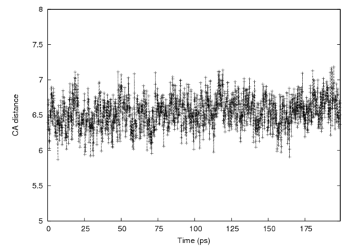
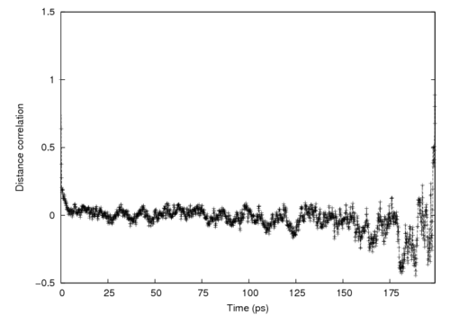
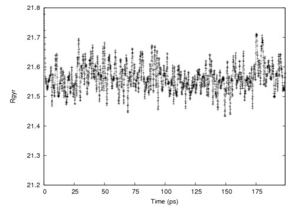

.. _usr-basic-fullexample:

.. todo:: This was ripped from charmmtutorial.org.  Make sure it all finds a home in the right place.

Full Example from CHARMMTutorial
================================

This section of the tutorial will present an example of a real molecular
dynamics simulation using the protein Crambin (PDB ID 1CBN). You will be able
to download the input scripts as you read along. These scripts are based off of
the inputs generated by CHARMMing with additional comments added and some
complexity that is only needed in an automated system removed. You should run
these on your own computer to get a feel for the type of output you can expect
to see from CHARMM. Suggested exercises are given to encourage you to modify
the scripts in various ways. It is highly recommended that you download the
tarball containing all of the inputs, outputs, and other files needed before
beginning to work through this example. All of the files are available in
`tar.gz format
<http://www.charmmtutorial.org/tutorial-data/crambin_example.tar.gz>`__ or `zip
format <http://www.charmmtutorial.org/tutorial-data/crambin_example.zip>`__.

Reading in the Crambin structure
--------------------------------

The first step of any simulation is getting your structure read into CHARMM.
Unfortunately, it is not always straightforward to just get a PDB file from
`the Protein Data Bank <http://www.pdb.org>`__ and load it up. This is mainly
because the PDB uses different naming conventions than CHARMM for some atoms
and residues. Fortunately, there are a number of tools that can help with this
such as the conv_pdb.pl script in MMTSB or the standalone PDB parser from
CHARMMing, which you can download `from this site
<http://www.charmmtutorial.org/tutorial-data/charmming_parser.tar.gz>`__. In
this case, we will start with a version of 1CBN that has been run through
CHARMMing's parser. In order to keep things simple, we will use only the
protein atoms and not the bound ligand (the hetero atoms). The parsed PDB with
the HETATMs removed can be found `here
<http://www.charmmtutorial.org/images/c/c2/1cbn-a.pdb>`__.

Reading in the PDB file
-----------------------

Background
**********

Correctly reading in a structure from the PDB can be one of the trickiest parts
of using CHARMM because of differences in format and nomenclature between PDB
files and what CHARMM expects.  `CHARMMing <http://www.charmming.org>`__ uses an
automated script to format the PDB into an amenable input source for CHARMM.
However, this automated procedure has some drawbacks, namely residue and atom
number is not preserved (we intend to fix this in the near future). Also, there
will be occasional instances where it will not work quite right for some reason
or another. In this case you will need to "roll your own"and the examples in
the script archive of the CHARMM forums should be of some use. In particular,
see the `complex PDB input
<http://www.charmm.org/ubbthreads-7-5-5/ubbthreads.php?ubb=showflat&Number=4116#Post4116>`__
post by Rick Venable. As a general rule, the script archive is a good place to
look for examples of how to do things in CHARMM. 

Our script
**********

The first input script to be used is `setup.inp
<http://www.charmmtutorial.org/images/7/75/Setup.inp>`__, which reads the
sequence and coordinates from the PDB file and creates the other data
structures needed by CHARMM. Most of this script should be reasonably
straightforward, however there are a couple of commands that have not been seen
previously:

* *READ SEQUence* tells CHARMM to read the sequence for the macromolecule from
  the file. For example, the sequence "ALA ALA" would refer to an alanine
  dipeptide.

* The *GENErate* command is used to create a new segment in the protein
  structure file. In this script, we do not read in a PSF, so the *GENErate*
  command effectively creates the PSF.

   * The *SETUp* option to *GENErate* tells CHARMM to create the internal
     coordinate (IC) tables.
   * a-pro is the identifier we give to the segment that we are generating
     (this is called the SEGID and is limited to 5 characters).
   * *first nter last cter* determine the terminal group patchings for the
     segments. NTER and CTER are the defaults for proteins and refer to the
     capping at each end of the peptide chain.

* The REWInd command tells CHARMM to begin reading a file again from the
  beginning (handy when you want to read two types of data from a file as we do
  here)!
* The IC commands in this file tell CHARMM to fill in missing data in the
  internal coordinate table with information from the parameter sets (bonds,
  angles, etc. being placed at their minimum). This data can then be used to
  build cartesian coordinates. However, since the PDB file already has
  cartesian coordinates for all of the atoms except the hydrogens, it is not
  really needed here (but it does not hurt to have it).
* The *HBUIld* command places the hydrogens relative to the heavy atom
  positions. Most PDB files do not have hydrogen positions, so this command is
  used within CHARMM to build them. Note that the hydrogen positions may not be
  optimal, so it is best to minimize these following the set-up.

Once we have all of the coordinates in place, we go ahead and save out our
newly created PSF and coordinate files.

Making the final structure
--------------------------

Now that we have the protein segment read in, there is still a little bit more
to do to get a really correct structure that we can work with. In many cases, a
protein will have more than one segment and they will all need to be prepared
separately, read in, and appended together to make a final structure. This can
be done with the APPEnd option to READ PSF and READ COOR. In this case,
however, we only have a single segment to read in so this step is somewhat
superfluous. It is presented here only because in a lot of cases you will need
to do it. However, there is one important thing we must do now! If you look at
the original 1CBN PDB from the Protein Data Bank, you will notice some lines in
the header that begin with *SSBOND*. These lines indicate that there are
disulfide bridges present in the protein, which can have a substantial effect
on the behavior of participating residues. These must therefore be added, which
is done via the PATCh command in CHARMM. There are other types of patches we
could include as well -- these are mostly used to change the protonation state
of a residue. For example, the ASPP patch adds an extra proton to an Aspertine
residue, giving it a net +1 charge.

In this case, however, we just want to apply the disulfide bridge patches. The
input script we have to do all of this is `append.inp
<http://www.charmmtutorial.org/images/2/25/Append.inp>`__. When you run it, be
careful to note the output from the *PATCh* command to make sure that the patch
was applied successfully. CHARMM does not always stop processing when a patch
application fails, which can lead to strange problems in later scripts.  There
are a couple of syntactic points to note as well:

* Note the syntax of the *PATCh* command: *PATCh <patch name> <residue
  selection(s)> <other options>*. In this case *DISUL* (for disulfide) is the
  name of the patch, 2 selections are needed (since a disulfide bridge links
  two residues, and the *SETUp* options is used again because the IC table is
  modified and thus needs to be re-created.

* We delete the hydrogen atom coordinates and re-place them once the patching
  is done. In this case this is not really necessary, however when appending
  multiple segments it is a good idea to re-create the hydrogen atoms
  coordinates with the whole structure in place. This will reduce bad contacts
  between the hydrogens and heavy atoms.

* The *IOFOrm EXTEnded* command tells CHARMM to print the coordinate files out
  in high precision (note: older versions of CHARMM may have trouble reading
  these in).

Vacuum minimization
-------------------

Basic notes
***********

Now that the structure has been prepared for use with CHARMM, the next step is
to minimize it. The input script (initial-minimization.inp) may be found `here
<http://www.charmmtutorial.org/images/5/5f/Initial-minimization.inp>`__ and you
may also download `the output file
<http://www.charmmtutorial.org/images/1/1b/Initial-minimization.out>`__.  As
mentioned in the [[FINAL Minimization|Minimization]] section of the tutorial,
there are several different methods for performing minimization. This script
implements a fairly straightforward routine of 100 steps of steepest descent
followed by 1000 steps of *ABNR* with a gradient tolerance of 0.01.  After the
minimization is completed, the COOR RMS command is used to show the difference
between the initial and final structures (the original coordinates are copied
to the comparison coordinate set (*COMP*) set via the *COOR COPY COMP* command
that is issued prior to minimization; by default *COOR RMS* prints out the root
mean square distance between the coordinates in the main and comp sets).

The PSF and initial coordinates are read in from the files created by the
append script. We only need to write out a new coordinate file since minimizing
the structure does not change the coordinates.

For real production use, this may be too much vacuum minimization. Restraints
might need to be applied to keep the structure from twisting too far out of
shape. Remember that the examples in this tutorial serve illustrative purposes
only. **You** are responsible for examining your outputs and visualizing your
structures after every step to make sure that they make sense in the context of
the work you are doing. Adding restraints is given as an exercise below.

Exercises
*********

* Modify the minimization script to do three separate rounds of minimization:
  (1) minimize only the hydrogens, fixing the heavy atoms, (2) minimize with
  the backbone C, N, and O atoms fixed and all other atoms free to move, (3)
  minimize with all atoms free. Which minimization reduces system energy the
  most?
* Use COOR DIFF to get the atom by atom difference between the initial
  coordinates and final coordinates. Which atoms moved the most? The least?

Solvation and neutralization
----------------------------

The first simulation we'll set up for this tutorial will be molecular dynamics
in explicit solvent. In order to continue on, we need to place a water
structure around the protein. Although Crambin is neutral, we will also place
it in a 0.15 molar solution of potassium chloride to illustrate the process of
neutralization.

Solvation
*********

The input file for solvation is `solvate.inp
<http://www.charmmtutorial.org/images/1/1b/Solvate.inp>`__ (the corresponding
output file can be downloaded `here
<http://www.charmmtutorial.org/5/5b/Solvate.out>`__. We have chosen to solvate
the Crambin in a rhombic dodecahedron (RHDO) because it is the most globular.
As seen earlier, the RHDO approaches the efficiency of a sphere, and so it is a
good choice for this system. A cubic or rectangular box would have worked well
too.

There are a few points of interest in this script:

* After the structure is read in, the *COORdinate ORIEnt* command is issued
  which centers the structure at the origin, making the longest axis of the
  protein correspond to the Cartesian X-axis and the second longest axis
  correspond to the Cartesian Y-axis. In our case this is OK because the water
  box is centered. If the water box is far off-center this can move the protein
  coordinates in an undesirable way. It is best to make sure that the water is
  pre-centered, but failing this you can do a *COOR STAT* on the water and then
  *COOR TRANS* to translate the water structure such that it is roughly
  centered.
* The dimensions of the three axes are determined via the *CALC* command.
  *CALC* allows for mathematical manipulation within CHARMM scripts
* The method of creating the water structure is that outlined on the [[FINAL
  Solvation|solvation]] page:

    * Delete the waters whose oxygen atoms are within 2.5 Å of the protein
      (note that the waters we read in are generated as segment BWAT for easy
      identification later). We do this by selecting *.BYRES.* all OH2 atoms
      within 2.5 angstroms of any atom that is not in segid BWAT or is a
      hydrogen. Pay careful attention to the syntax of the select statement --
      this can be a bit tricky!
    * Calculate the radius of a circle that will circumscribe the final RHDO
      (we call the radius variable *@safesphere* in the script) and then delete
      all waters outside it.
    * Create the crystal structure using *CRYStal DEFIne* and *CRYStal BUILD*
      Use the *IMAGe* command to force the whole BWAT segment to be updated by
      residue (*BYRES*). Recall that this means any water molecules in BWAT
      that are outside the unit cell will be translated back inside it when
      images are updated.
    * Save the current coordinates and use the UPDAte command to move the
      waters that are outside the RHDO back inside it.
    * Detect which waters have moved (via *COOR DIFF*) and delete them as
      extraneous.

* Minimize the final structure slightly to remove bad contacts. An alternate
  approach is to fix (useing *CONS FIX*) or restrain (using *CONS HARM* or
  similar; these are discussed on the [[FINAL Essential CHARMM
  Features|essential CHARMM features]] page) the Crambin and minimize only the
  solvent in this step.

This script, while complex, should be easily adoptable to different situations.
As an **exercise**, try solvating Crambin in a cubic box rather than an RHDO.
You should visualize both the cubic and the RHDO structures to make sure that
the protein is entirely surrounded by water with a sufficient buffer to ensure
that the Crambin won't interact directly with an image of itself.

Neutralization
--------------

The `neutralize.inp <http://www.charmmtutorial.org/images/5/5c/Neutralize.inp>`__
script is slightly simplified from the version used by CHARMMing, mainly by
removing support for triatomic salts such as MgCl:sub:`2`. In this script
we limit ourselves to the diatomic salt Potassium Chloride (KCl). Nonetheless,
this is still one of the most complex scripts used by CHARMMing. Once you have
the input script you may also download `its output file
<http://www.charmmtutorial.org/images/d/d8/Neutralize.out>`__

As mentioned on [[FINAL Neutralization|the Neutralization page]], the basic
idea of this script is to run a certain number of trials, each one of which
replaces a number of water molecules with counter-ions in order to achieve the
desired concentration. The trial that yields the lowest energy (after a brief
minimization) is then used. The first thing that is done is to calculate the
volume used by the entire system and the volume taken up by the protein, which
is accomplished by the *COOR VOLUme* command (this is necessary to get the
concentration right). As stated in the documentation, we must store the radii
of each atom in the first scalar array and the outer probe diameter in the
second. We also need to give a maximum number of cubic pixels via the *SPACE*
option. A larger *SPACE* value gives a more accurate answer at the cost of more
CPU time and memory. We use 168 times the number of atoms, which is a
reasonable heuristic. The total volume from *COOR VOLUme* is the sum of the
*?VOLUME* (space taken up by the atoms themselves) and *?FREEVOL* (space in
between them) CHARMM variables. When we have the total volume for the whole
system and for the protein, their difference is the volume of the solvent --
this is the space we have to insert the ions.

Once we know how much volume that we are dealing with, it is necessary to
figure out how many ions are needed. This is a fairly straightforward
calculation based on Avogadro's number, with the total number of ions needed to
achieve the desired concentration is stored in the *@totions* variable. The
number of charges necessary is then added (or subtracted) from *@totions*
depending on whether we need to add or subtract cations (positive charges). The
final result is stored in the *@nions* variable. We then make sure that an even
number of charges are added (since we have to pair positive and negative
charges except for the any additional ions needed to neutralize the system).
Finally we add negative or subtract positive charges as needed to neutralize
the system, storing the very final number of positive and negative ions in
*@ipos* and *@ineg*.

Once we know how many ions that we need to place, we enter into the main
Monte-Carlo loop. Right at the beginning, we use a neat trick to redirect the
output to another file to keep from cluttering up our "main" output file. To do
so, we open up a new unit for writing and then use CHARMM's *OUTUnit* command
to tell the program to send its output to the new unit we opened up. When we're
done with the loop (at the end of the script), we issue:

.. code-block:: chm

  outu 6

to tell CHARMM to go back to sending its output to unit 6 (which is standard
output on Unix-like systems).

In each iteration of the loop, the PSF and coordinates from solvation are
re-read so we start fresh each time. We then call a **stream file**
(addions.str). Stream files are just regular CHARMM scripts, but they can be
called by other CHARMM scripts (like a subroutine in other programming
languages). This allows us to modularize CHARMM scripts and re-use different
pieces of code without copying and pasting them into different scripts. In this
case the `addions.str <http://www.charmmtutorial.org/images/d/da/Addions.str>`__
stream file handles the actual placing of the ions. To do so, it first
generates two new segments, one for the positive ions and one for the negative
ions. All of the coordinates for the atoms in these segments are initially set
to zero via the COOR SET command. 

To actually place the ions, the script uses two loops, one for the cations and
one for the anions. The first step in each loop is to select which water
molecules are candidates for being replaced. We select all of the oxygens (type
OH2) that are part of water moleculaes that are at least 5.5 Å away from the
protein and from another ion (notice how SELEct AROUnd comes in handy). These
are the candidates for deletion! We then get a random number via the CHARMM
?RAND variable (which will produce a new random number between 0 and 1 each
time that it is used). To convert this random number to an atom number we
multiply it by the number of candidates for deletion, stripping out any
fractional part (via the *INTeger* function which can be used with *CALC*).
This gives us the variable *@in* -- the index of the atom within the selection
to replace. The *SUBSET* option is then used in the *SELECT* command to select
the *@{in}*th atom in the selection. We save its coordinates, assign them to
the ion, and then delete the water molecule by using *BYRES* in the delete
command (so that the whole water molecule is deleted, not just the oxygen).

After the ions are placed, we perform a brief minimization (10 steps of SD plus
25 steps of ABNR). Since the PSF has been cleared and reloaded, we must also
redo all of the crystal setup and shake (for ABNR). In general, whenever the
PSF is modified in any way existing constraints and possibly crystal data is
cleared. When in doubt, repeat the crystal set-up! This is also why it's
usually a good idea not to muck with the PSF within a script unless you know
you need to. We then compare the minimum energy value to the previously
realized minimum energy (stored in *@emin*, which is initially set to a
ridiculously high energy value). If it is lower, we write out the new
structure; if not, we simply move on, discarding it.

Exercises
*********

* Practice solvating Crambin in various types of structures (box, rectangle,
  hexagonal prism, octahedron). Make sure the protein can rotate 360 degrees
  without leaving the solvated box. Which structure is most efficient (highest
  ratio of protein volume to total volume)? Which is least efficient?
* Try altering the ion concentration and type of ion used (consult the CHARMM
  topology file for a list of supported ions). Can you cause an error by adding
  too many or too few ions? If so, how might this be avoided in the script?

Minimization with PBC
---------------------

With solvation and neutralization complete, we now have the very final PSF that
we will use for dynamics. However, the very brief minimizations done as part of
solvation and neutralization are probably not sufficient to completely remove
bad contacts, therefore we need to do a more thorough minimization of this
structure to place it at a lower potential energy. You can download the `input
<http://www.charmmtutorial.org/images/a/a9/Final-minimization.inp>`__ and
`output <http://www.charmmtutorial.org/images/4/4f/Final-minimization.out>`__.

Comments on setting up PBC
**************************

Because we are planning to run molecular dynamics with periodic boundary
conditions (PBC), it is necessary to perform our final minimization under the
same conditions. There are three basic steps steps for this: (1) defining and
building the crystal structure, (2) setting up images, and (3) configuring the
nonbond parameters. As in the case of neutralization, we must be careful to set
the crystal parameters to their correct values from solvation, so we just copy
the crystal dimension we calculate from the solvation script and re-do CRYSTal
BUILd. Setting up images requires us to define which parts of the system for
which we want image atoms created. We also need to define how image centering
will work, *i.e.* how atoms that move outside of the unit cell should be treated.
As a simulation progresses, some non-image atoms may move far away from the
primary structure; recentering allows CHARMM to pick new "primary" atoms from
among the images of these based upon their distance from the rest of the
primary structure. In order to activate this feature, the user must explicitly
state which atoms are allowed to be re-centered (the default is not to
re-center anything); atoms can be re-centered two ways: by segment and by
residue. In general, connected residues should be recentered by segment (after
all, you don't want to break up a polymer chain along a backbone bond!) and
non-connected segments (*e.g.* solvent) recentered by residue. This is the
approach we take in our script.

Once the crystal structure and images are set up, we can issue the NBONDs
command to set the nonbond parameters.

Exercises
*********

* Try minimizing only the solvent, keeping the Crambin fixed. How close to the
  minimum energy do you get simply by optimizing the solvent positions?  
* Find the RMSD between the Crambin minimized in vacuum and the Crambin
  minimized freely in the presence of solvent. How does the minimum energy
  structure change in the presence of solvent?
* Go back to the neutralization step and increase the ion concentration, and
  then re-minimize. Does Crambin have any charged surface residues? How do
  these affect the optimal positions of the ions?
* Try moving one of the ions right next to the protein. What happens to it
  during the course of the minimization?

Dynamics: heating
-----------------

Heating is performed via the `md-head.inp
<http://www.charmmtutorial.org/images/9/9c/Md-heat.inp>`__ script and
`its output file <http://www.charmmtutorial.org/images/a/af/Md-heat.out>`__.  The goal of this
script is to heat the system from 110K to 310K (since the low energy
conformation from minimization represents a structure that would likely be
present at a lower temperature). The choice of 110K is somewhat arbitrary; it's
mostly based on the fact that it is 200K lower than a reasonable physiological
temperature which makes the temperature incrementing scheme use round numbers.
For problematic structures, it may be necessary to start at a lower
temperature, decrease the heating increments, or reduce the timestep to lower
than 1 femtosecond (e.g. 0.5 fs).

Pre-dynamics Setup
******************

The setup for dynamics looks very similar to that used in the final
minimization with PBC. We once again need to set up crystals, images, and
nonbond parameters. The only new thing here is that we open up two units for
writing: unit 31 for the trajectory file and unit 41 for the restart file. Make
sure you open these in the correct manner; trajectory files are written as
binary data and must be opened *UNFOrmatted* (*FILE* is a synonym for
*UNFOrmatted*) while the restart file is plain text and can be opened with the
CARD keyword.

The DYNAmics Command
********************

If you paid attention to the [[FINAL MD|molecular dynamics]] page in this
tutorial, this should look fairly straightforward. The options to the
*DYNAmics* command may be given in any order, but to make this script more
legible I've grouped them by functionality. The first two lines set up basic
parameters (we want to run for 100 picoseconds (100,000 steps with a 1
femtosecond timestep) while writing coordinates to the trajectory and printing
the status periodically (100 and 1000 steps, respectively). We have to give the
unit numbers for the restart and coordinate files to the *IUNWRI* and *IUNCRD*
options.

The third line (starts with "firstt") and fourth line determine our heating
schedule. The temperature is increased by 5K every 2500 steps for a total
increase of 200K over the course of the run. Note that this is a much more
gradual heating than that set up by default by the publically accessible
CHARMMing install on `www.charmming.org <http://www.charmming.org>`__, as this
installation is limited to 1000 steps per dynamics run -- users who install
their own CHARMMing server may set the limit higher). The temperature bath is
set to the final temperature, but we do not do any equilibration (*IEQFRQ* is
0), just heating. The fifth line handles initial velocity assignment. In this
case velocities are assigned (not rescaled, since *ISCVEL* = 0) using a
Gaussian distribution (*IASVEL* = 1). We do not want to impose any external
checking of the temperature, so we set *ICHECW* to 0. *ICHECW* can be used to
conditionally rescale or reassign velocities if the temperature moves outside
of a predetermined range. The last three lines all control important options:
*NTRFRQ* determines the frequency at which CHARMM removes net rotation and
translation from the system. This is necessary when PME is used since otherwise
the system's energy can be diverted to this motion, leading to a "flying ice
cube." *NTRFRQ* should be set to somewhere between a few dozen and a few
thousand steps; it's not clear what an optimal value is, but it should be set
to '''something''' within this range. The *ISEED* option controls the seeds for
the random number generator. Two simulations with identical starting conditions
done with the same seed should yield identical results (numerical rounding
aside). Finally the *ECHECK* option tells CHARMM to abort the simulation if
total energy shifts more than 100 kcal/mol in one step. This is to provide a
watchdog against runaway energy changes which may be the result of model
building errors. Depending on the size of your system and the type of
simulation being run, it will probably be necessary to adjust this value.

Interpreting the Output
***********************

Until now, output from the scripts has been relatively short and
straightforward to interpret. However, since the output from DYNAmics is quite
long and involved, it makes sense to spend a little time figuring out exactly
what's what.

Immediately after the DYNAmics command, CHARMM prints out the options it is
going to use. Reading these is a good way to check that everything really is
set up the way that you want it (and that you didn't make any typos in your
DYNAmics command). After this is the output from the dynamics run itself. Every
NPRINT steps CHARMM will print out the energy at that particular step as well
as the amount of time (in picoseconds) that has been simulated and the current
temperature. It will also print the averages of these over all of the time
steps since the last print out in lines beginning with "AVER" and their
fluctuations in lines beginning with "FLUC". When calculating averages, it is
important to use the average values since only these reflect all of the time
steps in the simulation. Additionally, every *NTRFRQ* steps (in this case 500)
you will see a group of lines beginning with "DETAILS ABOUT THE CENTER OF MASS"
-- this data is used by CHARMM to stop translational and rotational motion.
Also, periodically you will see lines such as::

 SELECTED IMAGES ATOMS BEING CENTERED ABOUT 0.00000 0.00000 0.00000
 UPDECI: Nonbond update at step       176
 UPDECI: Image update at step       482

The first line indicates that the system is being recentered in the unit cell
(Remember the *IMAGE BYRES* and *IMAGE BYSEG* commands we used in the set-up?
They are at work here!). The next two lines indicate that the nonbond and image
atom lists are being updated. We set *INBFRQ* and *IMGFRQ* to -1 in our
*NBONDs* command, which means that these updates do not occur on any particular
schedule, but are done heuristically when the atoms in the system have moved
enough.

If you look to the end of the output, you'll see that molecular dynamics can
take some time, even for a relatively short simulation like this one. I ran
this script in parallel (4 processors) on a fairly modern machine and it still
took over 3 hours to complete.

Dynamics: equilibration and production runs
-------------------------------------------

Now that the system is heated up, it is usually wise to let it "settle in" and
the desired temperature via an equilibration run. There are several ways of
doing this (including using *IEQFRQ* in the NVE ensemble), but the method we
use here is to run NVT using the Hoover thermostat. This is the same script
that would be used for an NVT production run with Hoover, but it's often wise
to let a system equilibrate before collecting statistics from the trajectory.
We use the `md-equil.inp
<http://www.charmmtutorial.org/images/a/a4/Md-equil.inp>`__ script to run this
simulation, and you can find the output `here
<http://www.charmmtutorial.org/images/0/0f/Md-equil.out.gz>`__ (note that the
equilibration output is large enough that it has been gzipped to save space).
Some people like to use the NPT ensemble for equilibration and run with this
ensemble until the volume becomes stable. To modify this script to use NPT, use
must set a positive value for *PMASS*,

The three main differences between this scripts and the heating script are:

* The Hoover thermostat is used for temperature control; IHTFRQ and IEQFRQ are
  not used.
* Pressure statistics are reported (via the *PCONS* option), but constant
  pressure is not imposed (*PMASS* = 0)
* The Dynamics run is restarted, rather than started fresh
* We do 200 picoseconds of dynamics instead of 100

The crystal, image, and nonbond setups are the same as for heating, as you
would expect.

Restarting a Dynamics run
*************************

Restarting a dynamics run is relatively easy. We open the restart file from the
heating run and then pass its unit number to the IUNREA option to DYNAmics.
CHARMM tells us this worked with the lines::

  READYN> dynamics restart file was read. Current step=  100000
  NSTEP  =100000  JHSTRT =     0

The number of steps already run is tracked in the restart file. All of the
simulation times in the dynamics output will be global (*i.e.*, they will include
the time in previous simulations). We save out a new restart file at the end of
this run in case we want to extend it further. One word of advice: develop a
naming convention for your restart files and stick to it so you always know
which one to use. One method is to number them sequentially, *e.g.* dyn1.res,
dyn2.res, etc. Note that we name our restart file 1cbn-equil-1.dcd for this
reason.

Using the Hoover thermostat and constant pressure
*************************************************

The Hoover thermostat applies strict temperature control to the simulation and
is generally used for NVT runs. It requires the *CPT* keyword, even though
hoover can be run without constant pressure (as, indeed, we do). The line

.. code-block:: chm

 hoover reft 310.0 tmass @tmass

tells CHARMM to use it. Note that the *TCONS* keyword will invoke the
weak-coupling Berendsen thermostat and **should not be used**! We choose to
let the simulation run at 310K which is the final temperature from the heating
run (the temperature will still fluctuate slightly, however, particularly for
small systems). Also IHTFRQ and IEQFRQ are both set to 0 so CHARMM will never
try to use velocity assignment or rescaling for temperature control (even
though IASORS and IASVEL are turned on, they have no effect because IHTFRQ and
IEQFRQ are 0 and we are restarting the simulation). Likewise, pressure
reporting is invoked with:

.. code-block:: chm

  pcons pint pref 1.0 pmass @pmass pgamma 0.0

Since PGAMMA (piston collision frequency) is 0, we aren't damping the motion of
the pressure piston.

Trajectory Analysis
-------------------

A basic file for doing analysis can be found `here
<http://www.charmmtutorial.org/images/6/68/Md-analysis.inp>`__ (output file is
`here <http://www.charmmtutorial.org/images/c/c6/Md-analysis.out>`__.
This file runs through some basic analysis using the CORREL command. The end
result is to get three different properties from the simulation.

* The radius of gyration over time
* The distance between the alpha-carbons of residues 10 and 46
* The time correlation function of this distance

Residues 10 and 46 were chosen because some literature suggests that a
disulfide bridge between between these residues has implications for the
physical behavior of the macromolecule (see Bang et al, ''Mol Biosyst.'' 2009
Jul;5(7):750-6. Epub 2009 May 28). Extracting data from the trajectories takes
several steps:

* we first must set up the system using the exact same parameters as used with
  the MD simulation. This is because energies are not stored in trajectory
  files, just coordinates or velocities; we have to be able to calculate the
  energy under the same conditions as the MD run.
* the trajectory file from dynamics is opened for reading
* we then open a log file for each of the three properties. The log file will
  have the format "time: value" which can easily be plotted by GNUPLOT or a
  similar plotting program.
* correl itself is set up. We could use *MAXSeries 2* as we will only be
  working with three sets of data: the radius of gyration, the residue
  distance, and the time correlation of the distance, the last of which has its
  own special series set up by CHARMM. We will only be looking at a few atoms,
  so *MAXAtoms* is 50, likewise, there are 2000 time steps in our trajectory
  file. These numbers will change from run to run depending on what you want to
  look at.
* We use *ENTEr* to set up two sets of data, one for the radius of gyration (we
  name this data set "rgyr", *GYRA* is the key word that tells CHARMM this data
  set is to contain the radius of gyration at each step. Likewise a set for the
  CA-CA distance is created (the set is named "dist", the *BOND* keyword tells
  CHARMM that this set will contain the distance between two atoms (even though
  they are not bonded). The atom selection tells CHARMM which two atoms we
  want.
* We fill in the sets by reading from the trajectory file opened earlier
* We write both sets of data to their output files (we do this now since we
  need to modify the "dist" set to compute the time correlation).
* The *MANTime* command is used to subtract the average off from each element
  of the "dist" set (so each data point becomes a displacement from the mean).
* The *CORFUN* command is used to calculate the correlation of the "dist" data.
  It is implicitly saved in a set called "corr" (if we call *CORFUN* again
  before writing the data out, it will be lost!)
* We write the "corr" data set out in the same manner as "dist" and "rgyr"

Below are plots of the distance, radius of gyration, and time correlation:

    CA-CA distance between residues 10 and 46 of 1CBN from our dynamics trajectory.

    Time correlation calculated from the above data

    Radius of gyration of 1CBN from our dynamics trajectory.

The GNUPLOT scripts used to generate these images from the raw data files are
available in the complete tarball of this example.

These graphs show that the distance between the alpha carbons of the two
residues fluctuates around an average value slightly greater than 6.5 Å.
Likewise, the time correlation function drops styeeply, indicating that this
distance between these two residues quickly become uncorrelated with the
starting structure. Likewise, the radius of gyration fluctuates around 21.5 and
21.6 Å.

