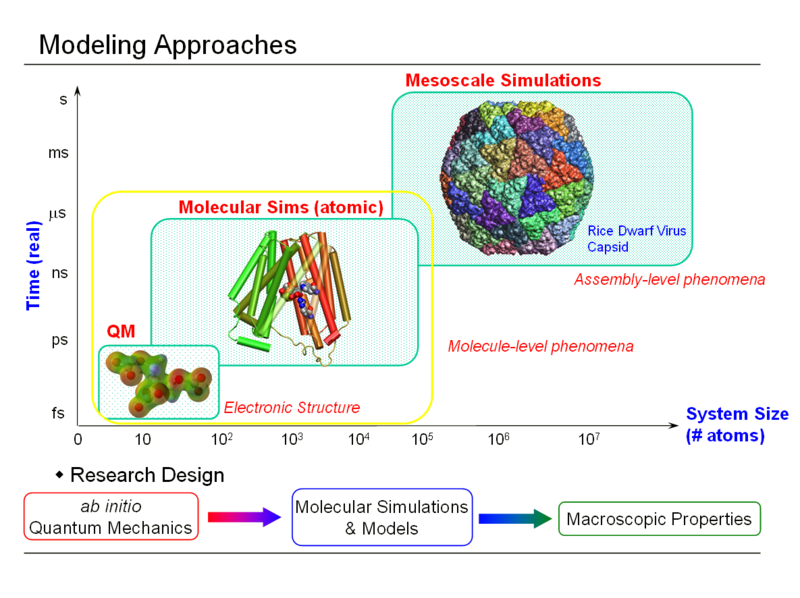

.. _usr-introduction:

Introduction
============

This document is designed to teach newcomers the basics of setting up and
running molecular simulations using the molecular simulation program `CHARMM
<http://www.charmm.org>`_. It has been written in conjunction with the `CHARMMing
<http://www.charmming.org>`_ web portal. CHARMMing is a tool that provides a
user-friendly interface for the preparation, submission, monitoring, and
visualization of molecular simulations (i.e., energy minimization, solvation,
and dynamics). The goal of this tutorial is to teach what is going on "behind
the scenes" of the scripts that CHARMMing generates. This will help bridge the
gap between using scripts developed by others and writing new CHARMM scripts to
perform tasks. This tutorial is aimed at readers with some knowledge of
molecular simulation (even if it's only classroom based or derived from using
graphical tools such as CHARMMing), who have basic competency with the
underlying physics, and who wish to use CHARMM to run a biomolecular simulation
and analyze the resulting data.

These readers will primarily be advanced undergraduate or beginning graduate
students. It does not aim to teach molecular simulation *per se*, but it does
give background when needed to understand the examples with appropriate
references given. The reader is not expected to know much about the practical
details of simulation, but the basic principles of physical and biological
chemistry are assumed to be known. To be specific, the reader is expected to
know basic facts about:

Assumed biochemistry background
-------------------------------

* `Biopolymers <http://en.wikipedia.org/wiki/Biopolymers>`_ (*e.g.* proteins,
  carbohydrates, and nucleic acid chains) and their constituent subunits (amino
  acids, monosaccharides, and individual nucleic acids).
* Sources of structural data (*e.g.* `the Protein Data Bank <http://www.pdb.org>`_,
  `Cambridge Structural Database <http://en.wikipedia.org/wiki/Cambridge_Structural_Database>`_).

Assumed physics / physical chemistry background
-----------------------------------------------

* Atomic structure, `ionic <http://en.wikipedia.org/wiki/Ionic_bond>`_, and `covalent <http://en.wikipedia.org/wiki/Covalent>`_  bonds, `bond energy <http://en.wikipedia.org/wiki/Bond_energy>`_.
* The relationship of atomic structure to system energy.
* `Nonbonded forces <http://en.wikipedia.org/wiki/Nonbonded_interactions>`_,
  such as `electrostatics <http://en.wikipedia.org/wiki/Electrostatics>`_ and
  `van der Waals <http://en.wikipedia.org/wiki/Van_der_Waals_interactions>`_ interactions.
* Some `statistical mechanics <http://en.wikipedia.org/wiki/Statistical_mechanics>`_, *e.g.*, the reader
  should have some familiarity with the basic ensembles (in particular
  `micro-canonical <http://en.wikipedia.org/wiki/Microcanonical_ensemble>`_ and
  `canonical ensemble <http://en.wikipedia.org/wiki/Canonical_ensemble>`_), know
  about relationships between `macroscopic <http://en.wikipedia.org/wiki/Macroscopic>`_
  and `microscopic <http://en.wikipedia.org/wiki/Microscopic>`_
  properties (*e.g.*, `temperature <http://en.wikipedia.org/wiki/Temperature>`_ and
  average `kinetic energy <http://en.wikipedia.org/wiki/Kinetic_energy>`_), and
  have heard about the `ergodic theorem <http://en.wikipedia.org/wiki/Ergodic_hypothesis>`_.

Assumed computer background
---------------------------

This tutorial assumes that you have login ability to a Unix machine (this
includes MacOS X). We further assume that CHARMM is already installed on this
machine and you know the command to invoke it. If you just received the CHARMM
distribution and need help installing it, here are  some
[[installation|installation instructions]].

Since CHARMM is a command line program, you need some familiarity with the Unix
shell (the Unix command line), even on MacOS X! You should be able to navigate
the directory hierarchy, copy and move files, and know how to use a text
editor. At the time of writing this tutorial, one good Introduction to the Unix
command line can be found `here <http://www.mhpcc.edu/training/vitecbids/UnixIntro/UnixIntro.html>`_; should
this link be broken google for something like "introduction to the unix command
line".

Suggested reading list
----------------------

This list of texts is not definitive, but books that the authors have found useful. 

* Biochemistry
    Material about properties of amino acids and nucleic acids, as well as the structure of proteins, DNA and RNA in, *e.g.*,

    * Phillips, Kondev, and Theriot. *Physical Biology of the Cell* [Phillips08]_.
    * Elliott & Elliott. *Biochemistry and Molecular Biology* [Elliott09]_.
    * Berg, Tymoczko and Stryer. *Biochemistry*. [Berg06]_.
      and similar tomes.

* Physical Chemistry
    Some general texts on physical chemistry contain quite good introductions
    to statistical mechanics/thermodynamics. In addition:

    * Hill. *An Introduction to Statistical Thermodynamics* [Hill87]_.
    * Dill and Bromberg. *Molecular Driving Forces: Statistical Thermodynamics in Chemistry & Biology* [Dill02]_.
    * Chandler. *Introduction to Modern Statistical Mechanics* [Chandler87]_.

* Molecular Simulation

    * Allen and Tildsley. *Computer Simulations of Liquids* [Allen89]_.
    * Becker, MacKerrell, Roux, and Wanatabe (*ed.*). *Computational Biochemistry and Biophysics* [Becker01]_.
    * Leach. *Molecular Modeling: Principles and Applications* [Leach01]_.
    * Frenkel and Smit. *Understanding Molecular Simulation* [Frenkel01]_.

* Unix computing and utilities

    * Robbins. *UNIX In  a Nutshell* [Robbins05]_.

About the molecular simulation field
------------------------------------

Molecular simulations are performed for a wide variety of purposes. Often, they
elucidate how subtle microscopic changes, such as the hydration of a protein
interior, affect larger scale processes such as the folding of that protein.
Molecular simulation is used across a breadth of disciplines in both organic
and inorganic chemistry, however CHARMM, and therefore this tutorial,
concentrates mainly on the study of systems of biological interest.
Biomolecular simulations can provide insight into reactions that may be
difficult to observe experimentally either due to the small size of the
compounds involved or the rapid time scale of the event. A variety of
techniques can be employed, from simple energy evaluations that can be
performed with relatively few operations to long running molecular dynamics or
monte carlo simulations using a complex system set up that can take months of
computer time. The exact tools used will depend on the type of questions that
the simulation (or group of simulations) is expected to answer. The end goal is
to provide insight into the physical nature of a system.

Simulations may be performed at different **levels of theory**, depending on
their goal. Perhaps the most familiar level is the classical all-atom
representation of the system where interactions are modeled without using
`quantum methods <http://en.wikipedia.org/wiki/Quantum_chemistry>`_. Higher
levels than this directly employ the quantum mechanical properties of the atoms
(they are used indirectly even in classical simulations as `force fields
<http://en.wikipedia.org/wiki/Force_field_(chemistry)>`_ are often parametrized
from quantum mechanical data). Lower levels than the `classical all-atom
<http://en.wikipedia.org/wiki/Molecular_dynamics>`_ generally use `coarse graining
<http://en.wikipedia.org/wiki/Molecular_dynamics#Coarse-graining_and_reduced_representations>`_
, *i.e.* multiple atoms are grouped together into a single point mass.  In
general, higher levels of theory yield more accurate results, but at the cost
of computer time. 

As computer power expands, so too does the range of questions that can be
answered by simulation. Currently modelers are able to simulate tens to
hundreds of thousands of atoms over a time scale of tens to hundreds of
nanoseconds at the classical all atom level of theory. Recent simulations of
microsecond length simulations of complex systems have recently been reported.
As important biological processes such as protein folding take place on the
order of microseconds, this is an important development. The increase in
computer power predicted (indirectly) by Moore's Law is expected to continue
for at least the next decade. Therefore, many previously intractable problems
should be solvable in the near future.

About CHARMM
------------

CHARMM (Chemistry at HARvard Molecular Mechanics) is a highly versatile and
widely used molecular simulation program. It has been developed with a primary
focus on molecules of biological interest, including proteins, peptides,
lipids, nucleic acids, carbohydrates, and small molecule ligands, as they occur
in solution, crystals, and membrane environments. The CHARMM program has been
produced over the last thirty years by a vast team of developers lead by Martin
Karplus's group at Harvard University. The program is distributed to academic
research groups for a nominal fee; a commercial version is distributed by
Accelrys.Information on acquiring CHARMM may be found on the
`CHARMM development project home page <http://www.charmm.org>`_.

The most up to date reference for CHARMM is a 2009 article in the Journal of
Computational Chemistry [Brooks09]_.

Basic Information on running CHARMM
-----------------------------------

CHARMM is a command line program that runs on UNIX and UNIX-like systems (this
is why, in the prerequisites section, we wanted you to have access to such a
machine). Graphics are available (however they are not covered in this
tutorial), but all interaction is done via text commands. Although CHARMM may
be used interactively, most use is done via pre-written scripts (i.e. lists of
commands that CHARMM executes). The following portion of the tutorial provides
the basic information needed to use CHARMM's (powerful) scripting language
effectively.

CHARMM can produce a number of files that may be input into third party
programs for visualization or analysis (e.g., VMD includes the capability to
read CHARMM coordinate and trajectory files). In general, this tutorial does
not deal with these third party programs. However, here is a quick example of
how to visualize CHARMM coordinate files with VMD:

    vmd -psf structure.psf -cor structure.crd

The best source of basic information about CHARMM and its capabilities are the
aforementioned journal article and the resources given in the following
subsection.

Sources of Further Information
------------------------------

* The CHARMM Web site `<http://www.charmm.org>`_.

    * Information on acquiring CHARMM `<http://www.charmm.org/html/package/license.html>`_.
    * Documentation `<http://www.charmm.org/documentation/current/index.html>`_.
    * Discussion forums (where you can ask for help) `<http://www.charmm.org/ubbthreads>`_.

* Parameter files for CHARMM force fields `<http://mackerell.umaryland.edu/CHARMM_ff_params.html>`_.
* Files from the 2013 CECAM CHARMM tutorial `<http://www.cecam.org/workshop-5-805.html>`_.

