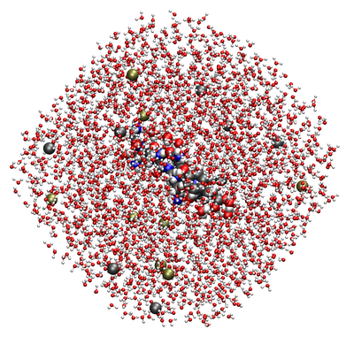
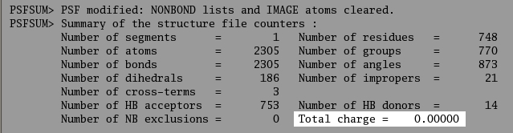

.. _usr-neutralization:

.. index:: Neutralization

Neutralization
==============

Some macromolecules may have an overall positive or negative charge instead of
being neutral. The implementation of the Particle Mesh Ewald method (PME) for
computing electrostatics that is present in CHARMM works most reliably when
there is no net charge on the system. Therefore, when a molecule has a charge,
it is generally thought best to cancel it out by adding counter ions to the
solution. It is easy to detect when this needs to be done since when CHARMM
reads in or modifies a PSF, it will output the total charge of the system as
shown in the following sample output.

The charge can also be calculated by printing out the *?STOT* variable after
running the *SCALar CHARge STAT* command.

Even if the system is neutral overall, it is often desirable to have an ion
concentration since this more realistically mimics the interior of a cell or
conditions in the blood stream. For example, it is known that cellular NaCL or
KCL concentration is on the order of 0.15M and therefore, enough sodium or
potassium and chloride ions will be added to both neutralize the system and set
the correct concentration. However, adding charged particles close to a protein
may influence its behavior in undesirable ways. Therefore, unless it is known
that ions are found in close proximity to the macromolecule, they should be
placed at some distance from it so that they are screened by the solvent.

Points to Consider before Neutralizing
--------------------------------------

There are a few things that need to be considered before you write a script to
perform neutralization.

* How many total counter-ions will be needed? Is there enough volume to
  accommodate them without getting too close to the solute?
* If you want to change the overall charge on the system (e.g. from +3 to 0)
  you will need different numbers of positive and negative ions (in this case,
  you would need 3 more negative ions than positive ones).
* Which ions should be used? CHARMM has parameters for a number of different salts.
* Are there any charged residues on the surface of the macromolecule that might
  be particularly disturbed in the presence of counter-ions?
* Conversely, are there any charged residues that might not behave correctly **without** a nearby counter-ion?

The example given in this tutorial describes a general procedure for
neutralizing a system, however it does not consider too carefully the points
mentioned above. You will need to understand the electrostatic and physical
behavior of your system to know what concentration of ions is most appropriate.

General Neutralization Procedure
--------------------------------

The neutralization procedure implemented in CHARMMing is described below and
uses a monte-carlo like method for picking a "good" configuration of ions in
the solvent. The basic idea is that solvent waters are randomly replaced (with
a few caveats) with ions. The system is then minimized briefly to remove bad
contacts and the final energy is stored. This is repeated a certain number of
times, and the minimized structure with the lowest total energy is chosen as
the final neutralized system.

A more detailed outline of the procedure is as follows:

* User inputs the desired salt and concentration (it is assumed that the final
  charge will be 0) as well as the desired number of trials.
* Compute number of positive and negative counter-ions required to achieve the
  desired concentration and to make the system neutral.
* Create the positive and negative ion segments in CHARMM.
* Define all possible water molecules that could be replaced by this ion. These
  are all bulk waters that are not too close to the solvent or to another ion
  (CHARMMing uses a 5.5 Å cut-off).
* For each ion to be placed:

    * Delete a water molecule at random. and add the ion in its place
    * Repeat until all ions required to reach the desired concentration have been added

* Perform short minimization (100 steps of steepest descent)
* Check the energy versus the previous lowest energy conformation
* If current energy is lower then previous then save the structure and return to step 4
* Repeat until the desired number of trials have been run

Needless to say, some of these steps require some advanced magic with the
*SELEct* command. A complete example of this is given [[FINAL Full
example|later on in the tutorial]].

